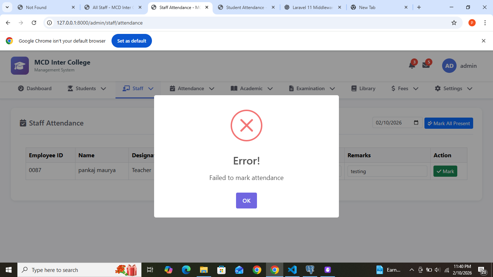

](image.png)# 🔐 Permission System - Complete Guide (Hindi)

## ✅ System Successfully Setup!

**Date**: February 10, 2026  
**Status**: Fully Functional

---

## 📊 Kya Data Seed Hua Hai

### 1. Roles (5 Total)
```
1. Super Admin - Sab permissions
2. Admin - Zyada tar permissions  
3. Teacher - Limited permissions
4. Accountant - Sirf fee management
5. Librarian - Sirf library management
```

### 2. Permissions (32 Total)

#### Student Management (4)
- view_students - Students dekh sakte hain
- create_students - Naye students add kar sakte hain
- edit_students - Students edit kar sakte hain
- delete_students - Students delete kar sakte hain

#### Teacher Management (4)
- view_teachers
- create_teachers
- edit_teachers
- delete_teachers

#### Staff Management (4)
- view_staff
- create_staff
- edit_staff
- delete_staff

#### Attendance Management (2)
- view_attendance - Attendance dekh sakte hain
- mark_attendance - Attendance mark kar sakte hain

#### Exam Management (5)
- view_exams
- create_exams
- edit_exams
- delete_exams
- enter_marks - Marks enter kar sakte hain

#### Fee Management (3)
- view_fees
- collect_fees - Fees collect kar sakte hain
- manage_fee_structure

#### Library Management (3)
- view_library
- manage_books
- issue_books - Books issue kar sakte hain

#### Academic Management (3)
- manage_classes
- manage_subjects
- manage_timetable

#### Reports (2)
- view_reports
- generate_reports

#### Settings (2)
- manage_settings
- manage_users

---

## 🗄️ Database Tables

### 1. `roles` Table
```sql
- id
- name (super_admin, admin, teacher, etc.)
- display_name (Super Admin, Admin, etc.)
- description
- guard_name (admin)
- is_active
- created_at, updated_at
- deleted_at (soft delete)
```

### 2. `permissions` Table
```sql
- id
- name (view_students, create_students, etc.)
- display_name (View Students, Create Students, etc.)
- module (students, teachers, staff, etc.)
- description
- guard_name (admin)
- is_active
- created_at, updated_at
- deleted_at (soft delete)
```

### 3. `role_permissions` Table (Pivot)
```sql
- id
- role_id (foreign key → roles)
- permission_id (foreign key → permissions)
- created_at, updated_at
```

### 4. `admin_roles` Table
```sql
- id
- admin_id (foreign key → admins)
- role_id (foreign key → roles)
- created_at, updated_at
```

### 5. `teacher_roles` Table
```sql
- id
- teacher_id (foreign key → teachers)
- role_id (foreign key → roles)
- created_at, updated_at
```

### 6. `staff_roles` Table
```sql
- id
- staff_id (foreign key → staff_members)
- role_id (foreign key → roles)
- created_at, updated_at
```

---

## 🎯 Kaise Kaam Karta Hai

### Step 1: Role Create Karo
```
Settings → Roles Management → Add Role
```
Example:
- Name: principal
- Display Name: Principal
- Description: School principal with full access

### Step 2: Permissions Assign Karo Role Ko
```
Settings → Assign Permissions
```
1. Role select karo (e.g., Principal)
2. Permissions select karo (checkboxes)
3. Save karo

### Step 3: Role Assign Karo User Ko
```
Settings → Assign Roles to Users
```
1. User select karo (Admin/Teacher/Staff)
2. Role select karo
3. Assign karo

### Step 4: Check Permissions
User login karega to uske role ke according permissions milenge.

---

## 📋 Default Role Permissions

### Super Admin
**Sab 32 permissions** - Kuch bhi kar sakta hai

### Admin
**23 permissions** - Modules:
- Students (all 4)
- Teachers (all 4)
- Staff (all 4)
- Attendance (all 2)
- Exams (all 5)
- Academic (all 3)
- Reports (all 2)

### Teacher
**6 permissions**:
- view_students
- view_attendance
- mark_attendance
- view_exams
- enter_marks
- view_reports

### Accountant
**3 permissions** - Sirf Fee Management:
- view_fees
- collect_fees
- manage_fee_structure

### Librarian
**3 permissions** - Sirf Library:
- view_library
- manage_books
- issue_books

---

## 🔧 Frontend Pages

### 1. Roles Management
**URL**: `/admin/settings/roles`

**Features**:
- View all roles in table
- Add new role (AJAX)
- Edit role (AJAX)
- Delete role (AJAX with SweetAlert2)
- Search/Filter

### 2. Permissions Management
**URL**: `/admin/settings/permissions`

**Features**:
- View all permissions grouped by module
- Add new permission
- Edit permission
- Delete permission
- Module-wise organization

### 3. Assign Permissions to Role
**URL**: `/admin/settings/assign-permissions`

**Features**:
- Select role from dropdown
- Checkboxes for all permissions
- Module-wise grouping
- Select All / Deselect All
- Save assignments

### 4. Assign Roles to Users
**URL**: `/admin/settings/assign-roles`

**Features**:
- Select user type (Admin/Teacher/Staff)
- Select specific user
- Select role
- Assign role to user
- View current assignments

---

## 💻 Code Examples

### Check Permission in Controller
```php
// Check if admin has permission
if (auth()->guard('admin')->user()->hasPermission('view_students')) {
    // Allow access
} else {
    // Deny access
}
```

### Check Permission in Blade
```php
@if(auth()->guard('admin')->user()->hasPermission('create_students'))
    <button>Add Student</button>
@endif
```

### Check Role
```php
if (auth()->guard('admin')->user()->hasRole('super_admin')) {
    // Super admin access
}
```

### Get User Permissions
```php
$permissions = auth()->guard('admin')->user()->getAllPermissions();
```

### Get User Roles
```php
$roles = auth()->guard('admin')->user()->roles;
```

---

## 🧪 Testing Kaise Kare

### Test 1: Role Create Karo
1. Go to: Settings → Roles Management
2. Click "Add Role"
3. Fill:
   - Name: test_role
   - Display Name: Test Role
   - Description: For testing
4. Click Save
5. ✅ Role table mein dikhna chahiye

### Test 2: Permission Assign Karo
1. Go to: Settings → Assign Permissions
2. Select Role: Test Role
3. Check kuch permissions (e.g., view_students, view_teachers)
4. Click Save
5. ✅ Success message aana chahiye

### Test 3: Role Assign Karo Admin Ko
1. Go to: Settings → Assign Roles
2. Select User Type: Admin
3. Select User: admin (username)
4. Select Role: Test Role
5. Click Assign
6. ✅ Role assigned successfully

### Test 4: Check Permission
1. Login as that admin
2. Try to access students page
3. ✅ Access milna chahiye (kyunki view_students permission hai)

---

## 🐛 Common Issues & Solutions

### Issue 1: Permission Check Nahi Kar Raha
**Solution**: 
- Check `HasRolesAndPermissions` trait model mein hai
- Check user ko role assigned hai
- Check role ko permission assigned hai

### Issue 2: Roles Page Blank
**Solution**:
- Check browser console for errors
- Run: `php artisan view:clear`
- Check database mein roles table hai

### Issue 3: Permissions Save Nahi Ho Rahe
**Solution**:
- Check CSRF token
- Check `role_permissions` table exists
- Check foreign keys properly set hain

### Issue 4: User Ko Multiple Roles
**Solution**:
- Ek user ko multiple roles assign kar sakte ho
- Sab roles ke permissions combine ho jayenge

---

## 📁 Important Files

### Models
```
app/Models/Role.php
app/Models/Permission.php
```

### Trait
```
app/Traits/HasRolesAndPermissions.php
```

### Controller
```
app/Http/Controllers/RolePermissionController.php
```

### Views
```
resources/views/admin/settings/roles.blade.php
resources/views/admin/settings/permissions.blade.php
resources/views/admin/settings/assign-permissions.blade.php
resources/views/admin/settings/assign-roles.blade.php
```

### Migrations
```
database/migrations/2026_02_07_222929_create_permission_tables.php
database/migrations/2026_02_10_225939_create_admin_roles_table.php
database/migrations/2026_02_10_230220_create_teacher_roles_and_staff_roles_tables.php
database/migrations/2026_02_10_231215_add_display_name_to_permissions_table.php
database/migrations/2026_02_10_231522_add_display_name_to_roles_table.php
database/migrations/2026_02_10_232033_create_role_permissions_pivot_table.php
```

### Seeder
```
database/seeders/RolesAndPermissionsSeeder.php
```

---

## 🚀 Next Steps

### 1. Middleware Banao
Permission check ke liye middleware:
```php
php artisan make:middleware CheckPermission
```

### 2. Route Protection
Routes ko protect karo:
```php
Route::middleware(['auth:admin', 'permission:view_students'])
    ->get('/students', [StudentController::class, 'index']);
```

### 3. Menu Items Hide/Show
Menu items ko permissions ke basis pe show/hide karo

### 4. Audit Log
Track karo kon kya kar raha hai

---

## 📞 Support

### Agar Koi Problem Hai:

1. **Check Logs**:
   ```
   storage/logs/laravel.log
   ```

2. **Clear Caches**:
   ```
   php artisan cache:clear
   php artisan config:clear
   php artisan view:clear
   ```

3. **Re-seed Data**:
   ```
   php artisan db:seed --class=RolesAndPermissionsSeeder
   ```

4. **Check Database**:
   - Roles table mein data hai?
   - Permissions table mein data hai?
   - Pivot tables properly linked hain?

---

## ✅ Summary

**Permission System ab fully functional hai!**

- ✅ 5 Roles created
- ✅ 32 Permissions created
- ✅ Default assignments done
- ✅ All tables created
- ✅ Frontend pages working
- ✅ AJAX operations working
- ✅ SweetAlert2 notifications
- ✅ Soft deletes enabled

**Ab aap:**
1. Naye roles bana sakte ho
2. Permissions assign kar sakte ho
3. Users ko roles assign kar sakte ho
4. Permission-based access control kar sakte ho

**Happy Coding! 🎉**
